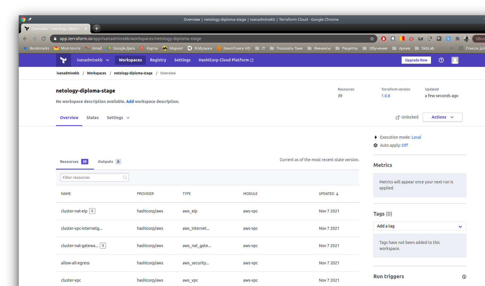

# Дипломный практикум в Cloud: Amazon Web Services"

## Описание решения

### Студент: Иван Жиляев

Решение буду описывать поэтапно, придерживаясь стуктуры задания.

### Создание облачной инфраструктуры

Последнюю стабильную версию Terraform я выкачал в виде бинарного файла и расположил в директории `/bin/`:

```
ivan@kubang:~/study$ terraform --version
Terraform v1.0.8
on linux_amd64
```

В качестве backend я выбрал Terraform Cloud (TFC) в варианте использования [CLI-driven Run Workflow](https://www.terraform.io/docs/cloud/run/cli.html) и типа [Standard](https://www.terraform.io/docs/language/settings/backends/index.html#backend-types) (удаленный backend только хранит состояние). Описание подходов к организации нескольких окружений в официальной документации доступно по [ссылке](https://www.terraform.io/docs/cloud/workspaces/configurations.html#organizing-multiple-environments-for-a-configuration).  
Доступ к удаленному backend для CLI-утилиты будет обеспечен за счёт указания токена пользователя TFC в файле `~/.terraformrc` ([справка](https://www.terraform.io/docs/cli/config/config-file.html#credentials)).

Я обнаружил, что в доп.материалах kubespray уже имеется манифест Terraform для организации инфраструктуры в AWS. Он будет основой для моего проекта.  
Содержимое репозитория kubespray я скопировал в каталог kubespray в своём репозитории. Манифесты Terraform располагаются в папке [kubespray/contrib/terraform/aws](https://github.com/nimlock/netology-diploma-ansible/tree/main/kubespray/contrib/terraform/aws).

Настроим доступ в AWS: в своём аккаунте AWS в сервисе IAM я создал service account `terraform`. Реквизиты доступа для этого пользователя я добавил в файл `~/.aws/credentials`, а также добавил их в файл с переменными для Terraform - `credentials.auto.tfvars` (добавлен в .gitignore).  
Позже, для деплоя проекта в аккаунт, предоставленный Нетологией, я обновил эти переменные для Terraform.

SSH-ключ `instance-ssh-key` для подключения к создаваемым инстансам я сгенерировал локально, публичную и закрытую части расположил в папке `kubespray/key`. Эту папку добавил в .gitignore.

Предложенный разработчиками kubespray манифест Terraform я дополнил файлами:
- [create-ingresses-ELB.tf](https://github.com/nimlock/netology-diploma-ansible/blob/main/kubespray/contrib/terraform/aws/create-ingresses-ELB.tf) - создаём дополнительный балансер для доступа к сервисам в кластере через ингресс-контроллеры
- [create-key-in-AWS.tf](https://github.com/nimlock/netology-diploma-ansible/blob/main/kubespray/contrib/terraform/aws/create-key-in-AWS.tf) - переносим данные о публичной части ключа SSH в AWS, для добавления его на создаваемые инстансы
- [create-route53-record.tf](https://github.com/nimlock/netology-diploma-ansible/blob/main/kubespray/contrib/terraform/aws/create-route53-record.tf) - добавляем wildcard DNS-запись, направляющую трафик адресованный поддоменам зоны `diplom.ivanadminekb.ru` к балансировщику, смотрящему на ингресс-контоллеры

Для проверки результатов дипломного проекта я делегировал зону `diplom.ivanadminekb.ru` NS-серверам AWS - соответствующую Hosted zone
завёл заблаговременно вручную в консоли AWS. Благодаря созданной в route53 на предыдущем шаге wildcard DNS-записи можно обратиться к поднятым в кластере сервисам, если назначить им на ингрессе доменные имена четвёртого уровня в упомянутой зоне. Так, например, основное приложение будет доступно по адресу [http://app.diplom.ivanadminekb.ru/](http://app.diplom.ivanadminekb.ru/).


>Примечание: так как в предоставленной Нетологией учётной записи AWS отсутствуют полномочия на работу с route53, то я закомментировал в манифестах блоки с созданием DNS-записей. Но код рабочий, функциональность проверена и удобна.
>Вместо делегирования зоны я вручную создал на своём DNS-сервере две CNAME-записи: одна для работы с API кластера - смотрит на API ELB, вторая для работы с сервисами в кластере - смотрит на ELB ингрессов.


---

Перейдём в каталог с шаблонами манифестов Terraform, а затем произведём инициацию бэкенда и создание workspace:

```
cd kubespray/contrib/terraform/aws/
terraform workspace new stage
terraform init
```

Теперь, когда workspace создан, нужно переключить его в режим локального исполнения команд (делаем workspace типа Standard). Для этого в web-консоли TFC зайдём в настройки workspace-а и там активируем `Settings - General - Execution Mode - Local`.

Наконец можно перепроверить и создать инфраструктуру командами:

```
terraform plan
terraform apply
```


### Создание Kubernetes кластера

Из-за того, что я воспользовался шаблонами Terraform, которые сразу подготавливают инвентори-файл для Kubespray, оба этих инструмента я расположил в одном [репозитории](https://github.com/nimlock/netology-diploma-ansible).

Несмотря на то, что [inventory-файл](https://github.com/nimlock/netology-diploma-ansible/blob/main/kubespray/inventory/hosts) уже готов, нам надо подготовить файлы с описанием переменных для плейбуков и ролей kubespray. Для этого я скопировал `kubespray/inventory/sample/group_vars` в [`kubespray/inventory/group_vars`](https://github.com/nimlock/netology-diploma-ansible/tree/main/kubespray/inventory/group_vars) и установил свои значения параметров.  
Конкретно: 
- значения `minimal_master_memory_mb` и `minimal_node_memory_mb` переопределял на 970, это позволяет запускать кластер даже на инстансах t2.micro, где `ansible_memtotal_mb` == 973
- `kube_network_plugin: flannel` - для снижения нагрузки на облачные инстансы я изменил дефолтный CNI с calico на flannel
- `ingress_nginx_enabled: true` - устанавливаем ингресс-контроллеры с nginx

Всё готово для установки кластера, запустим её командами:

```
cd ../../..     # return to kubespray main dir
pip install -r requirements.txt
ansible-playbook -i ./inventory/hosts ./cluster.yml -e ansible_user=ubuntu -b --become-user=root --flush-cache -e ansible_ssh_private_key_file=key/instance-ssh-key
```

---

Настроенные через Kubespray узлы кластера располагаются во внутренней сети, но доступ к ним можно получить используя бастион-хост. Конфигурацию для SSH-клиента Kubespray сгенерировал в файле [`ssh-bastion.conf`](https://github.com/nimlock/netology-diploma-ansible/blob/main/kubespray/ssh-bastion.conf).

Проверку кластера и какие-либо ручные работы с ним будем производить с мастер-ноды, из окружения root-а, т.к. в профиле этого пользователя Kubespray создал конфигурацию kubectl для подключения.

```
ssh -F ./ssh-bastion.conf ubuntu@${master_private_ip} -i key/instance-ssh-key 
sudo -i
```

Для подключения к кластеру из Интернета манифестами Terraform был создан ELB, прокидывающий трафик до API кластера. Для удобства я выделил DNS-запись для фиксации адреса подключения, это будет поддомен `k8s-api.diplom.ivanadminekb.ru`.

В дальнейшем для настройки CI/CD системы потребуются реквизиты для подключения к кластеру - сертификаты кластера и пользователя. Эти данные (в base64) можно получить на мастер-ноде используя команду:

```
kubectl config view --flatten=true
```


### Создание тестового приложения

Код приложения будет храниться в [репозитории на Gitlab.com](https://gitlab.com/nimlock-netology/netology-diploma-app/-/tree/main). Такой выбор обоснован тем, что на этой площадке будет удобно помимо хранения кода в git, также хранить собираемые образы docker в их registry, а также пользоваться системой CI/CD.

Приложение будет максимально простым - nginx с подгруженной картинкой и изменённым index.html.  
Содержимое [Dockerfile.app](https://gitlab.com/nimlock-netology/netology-diploma-app/-/blob/main/Dockerfile.app):

```
FROM nginx:1.20.1-alpine
WORKDIR  /usr/share/nginx/html
COPY image.png .
RUN echo "<html><h1>Hello! This is app for diploma.</h1></html>" > index.html
```

### Подготовка Kubernetes конфигурации

Конфигурация Kubernetes будет основана на предложенном проекте [kube-prometheus](https://github.com/prometheus-operator/kube-prometheus).

Все необходимые манифесты, а также дополнительный манифест для создания ingress для сервиса Grafana, расположены в [репозитории netology-diploma-k8sConfig](https://github.com/nimlock/netology-diploma-k8sConfig).

Для применения конфигурации кластера я подключился к мастер-ноде и выполнил команды:

```
git clone https://github.com/nimlock/netology-diploma-k8sConfig.git
cd netology-diploma-k8sConfig/
kubectl create -f manifests/setup
until kubectl get servicemonitors --all-namespaces ; do date; sleep 1; echo ""; done
kubectl create -f manifests/
```

В итоге нужные компоненты были установлены.

Реквизиты доступа к Grafana:
- URL: [http://grafana.diplom.ivanadminekb.ru/](http://grafana.diplom.ivanadminekb.ru/)
- user: `admin`
- password: `Netology-admin`

Требуемый дашборд доступен по [ссылке](http://grafana.diplom.ivanadminekb.ru/d/efa86fd1d0c121a26444b636a3f509a8/kubernetes-compute-resources-cluster?orgId=1&refresh=10s).


###  Установка и настройка CI/CD

Настройка CI/CD производится в файле [.gitlab-ci.yml](https://gitlab.com/nimlock-netology/netology-diploma-app/-/blob/main/.gitlab-ci.yml).

Первым этапом будет производиться сборка образа приложения и его загрузка в хранилище на Gitlab.com.

Для подключения из окружения CI/CD-системы к кластеру будем использовать отдельный служебный образ с установленными утилитами kubectl и helm. Докерфайл этого образа находится также в репозитории с кодом приложения, но имеет свои правила сборки - т.к. у него нет зависимостей от других файлов в репозитории, то пересобирать его будем только если поменялся его [Dockerfile.deployer](https://gitlab.com/nimlock-netology/netology-diploma-app/-/blob/main/Dockerfile.deployer). Этот образ будет иметь фиксированный тэг `deployer`.  
Процедуру сборки этого образа я вынес в отдельный файл [.gitlab-ci.deployer.yml](https://gitlab.com/nimlock-netology/netology-diploma-app/-/blob/main/.gitlab-ci.deployer.yml) чтобы не загромождать основной скрипт.

Шаг с деплоем я оформил в виде шаблона для удобства организации как автоматического выполнения по загрузке в репозиторий тэга (как обозначено в условии), так и ручного запуска деплоя по кнопке в графическом представлении пайплайна.


Для возможности подключения к кластеру из окружения раннера, нам нужно задать в свойствах проекта на Гитлабе переменные:
- CLUSTER_URL       - \<var> URL кластера с указанием схемы (https://) и порта (:6443)
- CLUSTER_CA_DATA   - \<file> сертификат кластера
- CLUSTER_USER_CERT - \<file> сертификат пользователя
- CLUSTER_USER_KEY  - \<file> закрытая часть сертификата пользователя

Данные по всем сертификатам мы получили ранее, посмотрев конфигурацию kubectl на мастер-ноде. Перед подстановкой сертификатов в Гитлаб нам необходимо лишь декодировать их:

```
echo -n '${шифротекст_из_конфига_kubectl}' | base64 -d
```

Проверка прошла успешно - поведение CI/CD-системы полностью соответствует заданию.


###  Всё что необходимо для сдачи задания

1. [Репозиторий с конфигурационными файлами Terraform](https://github.com/nimlock/netology-diploma-ansible/tree/main/kubespray/contrib/terraform/aws) и готовность продемонстировать создание всех рессурсов с нуля.
2. Пример pull request с комментариями созданными atlantis'ом или снимки экрана из Terraform Cloud.  
  

3. [Репозиторий с конфигурацией ansible](https://github.com/nimlock/netology-diploma-ansible/tree/main/kubespray), если был выбран способ создания Kubernetes кластера при помощи ansible.
4. [Репозиторий с Dockerfile тестового приложения](https://gitlab.com/nimlock-netology/netology-diploma-app/-/tree/main) и [ссылка на собранный docker image](registry.gitlab.com/nimlock-netology/netology-diploma-app:main-ec0132c0).
5. [Репозиторий с конфигурацией Kubernetes кластера](https://github.com/nimlock/netology-diploma-k8sConfig/tree/main/manifests).
6. [Ссылка на тестовое приложение](http://app.diplom.ivanadminekb.ru/) и [веб интерфейс Grafana](http://grafana.diplom.ivanadminekb.ru/) с данными доступа (`admin` / `Netology-admin`).
